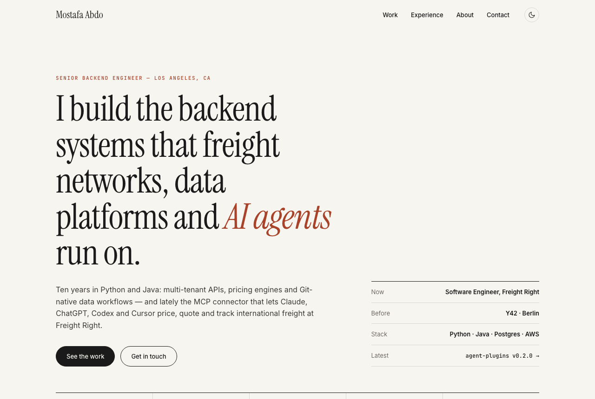

<div align="center">

# Mostafa Abdo

**Senior backend engineer · Los Angeles**

I build the backend systems that freight networks, data platforms and *AI agents* run on.

[**ronozoro.github.io**](https://ronozoro.github.io) &nbsp;·&nbsp;
[Résumé (PDF)](assets/Mostafa-Abdo-Resume.pdf) &nbsp;·&nbsp;
[LinkedIn](https://www.linkedin.com/in/ronozoro) &nbsp;·&nbsp;
[mostafa.abdu007@gmail.com](mailto:mostafa.abdu007@gmail.com)

<picture>
  <source media="(prefers-color-scheme: dark)" srcset="assets/preview-dark.png">
  
</picture>

</div>

---

## At a glance

| | |
|---|---|
| **Now** | Software Engineer, [Freight Right](https://www.freightright.com), building the MCP connector and [agent plugins](https://github.com/freight-right/agent-plugins) that let AI assistants price, quote and track freight |
| **Before** | Y42 (Berlin), where I built Git-native data workflows for a data-orchestration platform |
| **Side** | Founder of [Zolvio](https://apps.shopify.com/zolvio), an AI conversion-optimization app on the Shopify App Store |
| **Stack** | Python · Java · Django · FastAPI · Spring Boot · Postgres · AWS · GCP |

**10+** years shipping backend systems · **16** MCP tools in production · **6** AI clients supported · **500+** Shopify merchants on the freight integration · **100K+** daily payment transactions handled

## Selected work

1. **MCP connector & agent plugins for international freight** (Freight Right, 2025–26). 16 OAuth 2.1 + PKCE tools and five workflow skills. Read-only by default, and nothing gets booked without the customer. The release is gated on 17 of 17 behavioural evals.
2. **Zolvio** (founder, 2026). Store audits with 43 built-in checks, AI screenshot analysis, session replay, heatmaps and A/B tests. Built on Claude models.
3. **Git-native data workflows** (Y42, 2022–24). A Git proxy with GitHub, GitLab and Bitbucket behind one integration layer, a PR service that gates production, and a multi-workspace Spaces API that cut onboarding time by 40%.
4. **[Freight Rates API](https://www.freightright.com/technology/freight-rates-api) & carrier rate orchestration** (Freight Right, 2025). Python/Django orchestration across 8 carrier providers powering instant quotes and the Rates API for marketplaces and freight resellers.
5. **[CartRight](https://apps.shopify.com/freight-right-easy-ship)** (Freight Right, 2025–26). A Shopify app that prices LTL and international freight at checkout and fulfils in one click via CargoWise across 6 freight providers. It cut catalog pagination calls by up to 80%. [How it works](https://www.freightright.com/solution/shopify-selling-internationally-large-high-value-freight)

## Experience

| When | Where | Role |
|---|---|---|
| 2025 – now | Freight Right · Los Angeles, CA | Software Engineer |
| 2022 – 2024 | Y42 · Berlin, Germany | Software Engineer |
| 2021 – 2022 | Proactive Solutions · Riyadh, Saudi Arabia | Software / Data Engineer |
| 2018 – 2021 | Expert · Riyadh, Saudi Arabia | Full Stack Developer |
| 2017 – 2018 | IT Systems Corporation · Cairo, Egypt | Backend Developer |
| 2016 – 2017 | Hintegration · Cairo, Egypt | Software Engineering Intern |

**Education:** M.S. Computer Science, Westcliff University (2025) · Postgraduate ML, ITI Cairo (2021) · B.S. Computer Science, Fayoum University (2016)

---

## About this site

The site is hand-built: one HTML page, one stylesheet and ~60 lines of JavaScript. There are no frameworks, no build step and no trackers.

- **Editorial layout.** Instrument Serif for display type, Inter for body text, JetBrains Mono for labels.
- **Light and dark themes.** It follows the OS by default. The toggle remembers your choice and is applied before first paint, so the page never flashes the wrong theme.
- **Responsive** from 320px phones up to wide desktops.
- **Accessible.** It has semantic landmarks, a skip link, visible focus rings, and it honours `prefers-reduced-motion`.
- **SEO-ready.** It includes Open Graph and Twitter cards and `Person` JSON-LD.

```
.
├── index.html        # the whole page: content lives here
├── styles.css        # design tokens (light + dark) and layout
├── script.js         # theme toggle, scroll reveals, active nav link
├── data.json         # structured résumé data (not read by the page)
└── assets/
    ├── Mostafa-Abdo-Resume.pdf
    └── preview-{light,dark}.png
```

### Run it locally

```bash
python3 -m http.server 8000   # then open http://localhost:8000
```

### Edit it

- **Content:** edit `index.html` directly. Each section is commented (`Hero`, `01 Work`, `02 Experience`, ...).
- **Colours and fonts:** change the tokens at the top of `styles.css`. Dark mode redefines the same tokens.
- **Résumé:** replace `assets/Mostafa-Abdo-Resume.pdf`, keeping the same file name.

GitHub Pages deploys every push to `main`.

<div align="center"><sub>© Mostafa Abdo · Los Angeles</sub></div>
